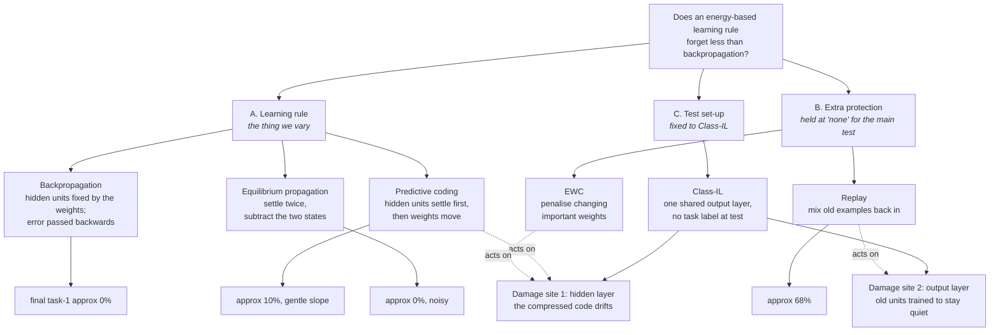
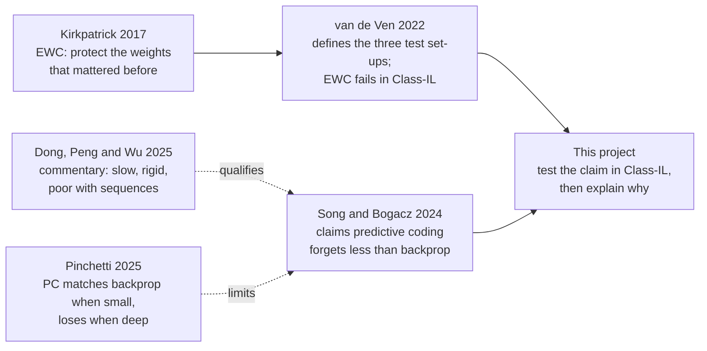

# Knowledge Base

**Purpose.** Single reference point for the MSc project. Consolidates everything established, everything refuted, everything still open. Loaded at the start of each response.

**Maintenance rules**
- New information is *added*; existing entries are *amended* in place; contradictions are *resolved* and the resolution recorded.
- Every substantive claim carries a tag: `[SETTLED]` (verified from source or code), `[EMPIRICAL]` (from our runs, provisional until re-derived from logs), `[HYPOTHESIS]` (untested), `[REFUTED]` (kept deliberately, so it is not re-derived).
- Numbers read off plots are marked `≈` and are **not citable** until re-derived from logged arrays.
- References live in §13 with links and one-line summaries. Nothing is cited in-text without appearing there.
- Terminology is kept plain. Any technical term or abbreviation used in this file is defined in the glossary at §14. If a new term is introduced, it is added there in the same edit.

**Last updated:** session S4 (see `timeline.md`).

---

## 0. Map and key

### 0.1 How the pieces fit together



Read the bottom row this way: the only method that retains anything is the one acting on the **output layer**. That is the main evidence that, in this set-up, the output layer is where most of the damage is — see §4.6.

### 0.2 The studies and how they relate



### 0.3 Key to the labels used in these two files

| Label | Means | Lives in |
|---|---|---|
| `S0`–`S4` | **Session** — one past chat, used to group timeline entries | `timeline.md` |
| `T001`… | **Timeline entry** — one objective and its outcome; append-only | `timeline.md` |
| `D1`–`D6` | **Discrepancy** — two of our own recorded numbers disagree | §7 |
| `CTRL-1`–`CTRL-6` | **Control** — a variable that must be matched before methods can be compared | §8 |
| `H1`–`H6` | **Hypothesis** — a claim we have not yet tested | §10.3 |
| `[SETTLED]` | Verified against a source paper or against the code | throughout |
| `[EMPIRICAL]` | From our own runs; provisional until re-derived from logged arrays | throughout |
| `[HYPOTHESIS]` | Not yet tested | throughout |
| `[REFUTED]` | Kept on purpose, so it is not accidentally re-derived | throughout |

**There are no other label families — no `M` and no `P`.** Anything else that looks like a code (MT, SIT, MIT, NI, NC, NIC, NCM, CKA, BWT, BPTT) is an abbreviation from the literature, not one of our labels. All are expanded in the glossary at §14.

---

## 1. The question

**Report:** ~10,000 words, neural computation / AI masters course. *Evaluating EBMs as an alternative to backpropagation for mitigating catastrophic forgetting.*

**Advisor's four-point scope (authoritative; supersedes all wishlists) `[SETTLED]`**
1. Pick **one** EBM. Acknowledge others exist; reviewing some is desirable, not essential.
2. Compare catastrophic forgetting in that model versus a backprop model.
3. Understand *why* they differ. Can trivial differences — coding sparsity, network size — explain it?
4. Try to reduce forgetting in the EBM. EBMs are predictive, so find the nodes whose predictions differ most and select only those for learning new stimuli. Does it work?

**Deferred by the advisor — do not chase:** generative/synthetic replay, VAE example-ordering, the 3×3 scenario×dataset grid, other EBM families, efficiency comparisons.

**Chosen EBMs.** EqProp is the formal "pick one" (point 1). PC was added because **the prospective-configuration claim is PC's claim, not EqProp's** — testing the literature's claim requires PC. `[SETTLED]`

---

## 2. The framework that resolves most confusion

### 2.1 Three things that vary independently `[SETTLED]`

Most apparent contradictions in this literature come from collapsing these into one list.

| Axis | Question | Options |
|---|---|---|
| **A. Credit assignment** | How do weights change? | backprop · predictive coding / prospective configuration · EqProp · contrastive Hebbian |
| **B. CL mitigation** | What extra machinery protects old knowledge? | none · parameter reg. (EWC, SI) · functional reg. (LwF, FROMP) · replay (ER, DGR, BI-R) · context-specific components (XdG, separate nets) · template-based (iCaRL, generative classifier) |
| **C. IL scenario** | Is context identity known at test? | Task-IL · Domain-IL · Class-IL |

**Key consequence:** an EBM is an *axis-A* intervention; EWC and replay are *axis-B* interventions. They are not rivals — they compose. The project's thesis is that changing axis A **alone**, with no axis-B machinery, reduces forgetting. That framing also makes a negative result publishable.

### 2.2 IL scenarios (van de Ven et al. 2022) `[SETTLED]`

Distinguished by whether context identity is known at test and, if not, whether it must be *inferred*.

| | Task-IL | Domain-IL | Class-IL |
|---|---|---|---|
| Mapping | f: X × C → Y | f: X → Y | f: X → Y × C |
| Context ID at test | given | not given, not needed | not given, **must be inferred** |
| Output layer | multi-head | single, fixed | single, global/expanding |
| Cross-context discrimination | never required | not required | **required** |

**Training-time axis, frequently conflated with the above:** *task-free* = no boundaries during training; *task-agnostic* = no context labels needed at any point. State both explicitly.

**Target regime for this project: Class-IL under a task-free stream.** The one cell where regularisation provably isn't enough and where the deficit is specifically inter-context discrimination.

### 2.3 Two other taxonomies that are not the same thing `[SETTLED]`

**Data shift** (Moreno-Torres et al. 2012), via p(x,y) = p(y|x)·p(x) = p(x|y)·p(y):

| Shift | Changes | Held fixed | Architectural home |
|---|---|---|---|
| Covariate | p(x) | p(y\|x) | features / BatchNorm stats (AdaBN often fixes free) |
| Prior probability (label shift) | p(y) | p(x\|y) | **output-layer biases only** — logit adjustment fixes it |
| Concept | p(y\|x) | p(x) | output weights; unavoidable overwrite in a shared head |

**Stream carving** (Maltoni & Lomonaco 2019) — how the incoming stream of data is cut into chunks. Their abbreviations, expanded:

| Abbrev. | Full name | Meaning |
|---|---|---|
| **MT** | Multi-Task | Separate, isolated tasks; one output group per task |
| **SIT** | Single-Incremental-Task | One task that keeps being extended; one shared output group |
| **MIT** | Multiple-Incremental-Tasks | Several tasks, each of which is itself extended over time |

Within SIT, what arrives can be **NI** (New Instances — more examples of classes already seen), **NC** (New Classes — classes never seen before), or **NIC** (both). **SIT with New Classes is essentially the same situation as Class-IL.**

> ⚠️ **The taxonomies genuinely disagree.** Permuted MNIST is **MT** for Lomonaco (tasks are isolated) but explicitly **Domain-IL — not Task-IL** for van de Ven. Neither is wrong; they measure different things. Always check which axis a paper means by "multi-task".

---

## 3. Model and learning-rule map

### 3.1 Architecture vs learning rule `[SETTLED]`

| | **Architecture** (what units exist) | **Learning rule** (how weights change) |
|---|---|---|
| Standard DL | **FFNN** — value units, one-way | **Backprop** — chain-rule gradient of an output loss |
| Energy-based | **Hopfield net**, **PCN** (adds error units) | **EqProp**, **Prospective Configuration** |

- **EBM** — umbrella: a scalar energy E(x; w) over the state; both inference and learning minimise it.
- **Hopfield network** — ancestral EBM: homogeneous units, symmetric recurrent weights, pairwise-interaction energy, attractor dynamics. **No explicit error variable** — which is exactly why EqProp needs *two* phases: with no error node, the only way to recover the signal is to subtract two equilibria.
- **PCN** — hierarchical EBM with value nodes x and error nodes ε; energy = sum of squared prediction errors. Explicit error nodes buy (i) a one-shot local update Δw ∝ ε_post·f(x_pre), (ii) a directed hierarchy instead of a recurrent soup, (iii) one relaxation instead of two.
- **Prospective Configuration** — the *rule* on a PCN: settle activities to a target-consistent state first, then one local weight update.

### 3.2 The sharpest distinction `[SETTLED]`

> In backprop the hidden activities are **fixed by the weights**. In PC and EqProp they are **variables that get optimised first**, and only then do the weights change.

Exact statement: take the PCN energy E = Σ_l ½(x_l − w_{l−1} f(x_{l−1}))². **Clamp every hidden x_l to its feedforward value** — every error is zero except at the output, and E reduces to *exactly* the FFNN output loss. **The FFNN is the PCN with its internal state frozen to the forward pass.**

All energy-based rules run an **EM-like two-step** (Dong, Peng & Wu 2025): E-step = activities relax to low energy; M-step = weights move to make that state more probable. **Backprop collapses the two** — it has no inner loop at all.

### 3.3 Side-by-side `[SETTLED]`

| | backprop | predictive coding | EqProp |
|---|---|---|---|
| hidden activities | fixed by weights | **variables — settle to a target** | **variables — settle twice** |
| credit assignment | chain rule from above | inferred by relaxation | difference of two equilibria |
| weight update | global backward pass | local: pre-activity × post-error | local: free vs nudged difference |
| passes per update | 1 fwd + 1 bwd | 1 settling | 2 settlings |
| gradient | exact | exact at equilibrium | approximate (β-biased) |
| clamping | — | **strong clamp** | **weak clamp** |
| target at output | supervision signal | clamped | a perturbation, not a target |
| non-target classes | softmax suppression | one-hot → 0 | **hinge → −1 (strongest suppression)** |

### 3.4 Symbols — do not confuse `[SETTLED]`

- **α** — weight learning rate: how far *weights* step, once, per learning update.
- **γ** (or `dt`) — settling rate: how far *activities* move per relaxation iteration.
- **β** — EqProp's **nudge**, *not* a learning rate: the size of a deliberate perturbation used to estimate a gradient by finite difference. It appears **in the denominator** (Δw ∝ (1/β)(nudged − free)); the estimate becomes exact as β → 0.

### 3.5 Where `f` sits `[SETTLED]`

Song–Bogacz convention: the prediction of layer l is w_{l−1} f(x_{l−1}) — **nonlinearity then weight**. So x is the raw node state (membrane-potential-like) and f(x) is the rate it sends onward. Not the textbook a_l = f(W a_{l−1}). Visible in the update, where the presynaptic factor is f(x_l), not x_l. A modelling convention only; different PC papers place f differently.

### 3.6 Is the global energy biologically implausible? `[SETTLED]`

**No — it is never computed, stored or transmitted by the network.** It is a Lyapunov function (a quantity that only ever decreases, used to prove the dynamics settle) written down by us, the analysts, not by the network. Because the energy is a **sum of local terms**, its gradient with respect to any local variable is itself a purely local expression. This is precisely the objection that sinks *backprop's* plausibility (nonlocal backward pass) and that EBMs escape.

### 3.7 The three regimes of the PC↔backprop relationship `[SETTLED]` — critical for the methods chapter

1. **Partial relaxation / infinitesimal nudging → *approximates* backprop.** Whittington & Bogacz (2017) is literally titled "*An approximation* of…". Updating activities for only the first few steps makes the PC update *equal* backprop's. Millidge et al. (2022, arXiv:2206.02629) unify PC, EqProp and contrastive Hebbian learning as all reducing to backprop in the infinitesimal-inference limit.
2. **Engineered exact equivalence** (Song et al. 2020, Z-IL) — but Dong, Peng & Wu note this equivalence **is not general**: it requires specific initialisation, a precise layer-wise update schedule and particular inference settings.
3. **Full relaxation to equilibrium → prospective configuration, genuinely ≠ backprop.** This is the actual contribution of Song et al. 2024.

> "Same result, different route" is true **only in the small-step limit**. Turning settling all the way up is what makes it a different algorithm.

**Corollary for EqProp `[SETTLED]`:** EqProp's weak clamp with β→0 suppresses the very activity shift that *is* prospective configuration. Song & Bogacz name equilibrium propagation explicitly as an example of setting up energy-based networks "unnaturally" to approximate backprop. So EqProp is a **finite-difference estimator of backprop's gradient**, inheriting backprop's interference and adding estimator variance plus finite-β bias. **EqProp scoring below backprop is the expected result, not an anomaly.**

---

## 4. Mechanics of catastrophic forgetting

### 4.1 Core gradients `[SETTLED]`

```
Softmax + CE:    ∂L/∂z_o = p_o − 1[o=t]        (no fixed point; unbounded competition)
                 ∂L/∂w_o = (p_o − 1[o=t])·h
                 ∂L/∂b_o =  p_o − 1[o=t]

Linear + MSE:    ∂L/∂z_o = z_o − y_o           (fixed point at z_o = 0 ⇒ w_o ⟂ current features)
Sigmoid + BCE:   ∂L/∂z_o = σ(z_o) − y_o        (decoupled forward, still-coupled labels)
```

For an old class with no data present: ∂L/∂w_o = p_o·h and ∂L/∂b_o = p_o. Over thousands of iterations b_o drifts monotonically **down** and w_o is pushed **anti-parallel to the current feature mean**. **No old data is involved and the trunk may be entirely intact.**

### 4.2 The active set — which output units the loss is allowed to touch `[SETTLED]`

Scenario → 𝒜 → which gradient paths exist → which mechanisms can fire → which method families can possibly work.

- **Task-IL / multi-head:** 𝒜 = current context only. Old heads are *literally disconnected from the loss* (zero gradient). No output-layer interference by construction. This is why EWC/SI work well here and why Separate Networks has exactly zero forgetting.
- **Domain-IL / single fixed head:** head is shared and receives gradients, but every class is positive in every context, so suppression is **symmetric** — no recency bias.
- **Class-IL / single global head:** only current-context classes ever appear as positives ⇒ **asymmetric suppression at full strength**.

### 4.3 Two distinct pathologies in Class-IL `[SETTLED]` — the most useful decomposition so far

1. **Logit suppression / task-recency bias** — a **calibration** failure. Features are fine; per-class scale and offset are wrong. **Cheap to fix, no replay needed** (masking, cosine classifier, weight alignment, NCM).
2. **Absent inter-context discriminative signal** — a **representation** failure. A boundary must be placed between classes never co-observed, with no gradient ever comparing them. **Irreducible**; requires information about old classes from somewhere.

"Class-IL needs replay" is only true of pathology 2 — and even then "replay" can mean a generative model or class prototypes rather than a buffer.

### 4.4 Full forgetting-mechanism map `[SETTLED]`

| Mechanism | Lives in | Bites in | Replay-free fix |
|---|---|---|---|
| Trunk representation drift | shared layers | all three | EWC/SI, gating, freezing, prospective configuration |
| Old output weights no longer match the hidden code they read | output layer applied to changed features | Task-IL, Domain-IL | stabilise the hidden layers |
| **Logit suppression / recency bias** | output layer | **Class-IL only** | masking, cosine classifier, weight alignment, NCM |
| **Missing inter-context boundary** | decision function | **Class-IL only** | prototypes, generative classifier — or replay |

### 4.5 Dropping the softmax — an important correction `[SETTLED]`

**Diagnosis was off.** Suppression comes from the **one-hot target supplying zero for every absent class**, not from softmax. Softmax is the transport mechanism; the label is the source. Units get decoupled in the forward pass; **the labels stay coupled**.

**Where the intuition is right:** MSE's suppression has a **fixed point at zero** — w_o is driven only until orthogonal to current features, so if old-class features occupy a different subspace w_o can stay informative. Softmax has no fixed point; z_o is driven toward −∞ relative to z_t and w_o accumulates an unbounded anti-h component.

Three components that were being treated as one:

| Component | Function | Cost of removing |
|---|---|---|
| Normaliser Σⱼe^{zⱼ} | couples classes; **provides a common scale** | loses calibration |
| Negative targets in the label | **the actual source of suppression** | requires masking |
| Active set 𝒜 | which output units the loss is allowed to touch | *this is the part that actually controls the behaviour* |

**The tension, plainly:** more coupling → better calibration, more suppression; less coupling → less suppression, worse calibration. **You cannot win both with the same knob.**

**Resolution relevant to this project:** a **generative classifier** trains p(x|y) per class in isolation with **no negatives at all** (zero suppression by construction), and gets its common scale from every class model being a normalised density over the same input space x rather than from a shared denominator. Cross-class comparability *without* cross-class coupling. **That is already the architecture that resolves the tension, and it is what E_sharp + E_smooth is.**

### 4.6 Where does forgetting actually live — the hidden layer or the output layer? `[SETTLED]`

The rest of the project hangs on this, so it is worth stating slowly and without jargon.

**The two places knowledge can be damaged.** Our network has three groups of numbers: 196 input pixels, 64 hidden units, 10 output units.

- The **hidden units** hold a compressed description of the image — the features, or receptive fields. Damage here means the network can no longer tell the digits apart *internally*.
- The **output units** are the decision stage. Each has a weight vector that reads the hidden description and produces a score; the network answers with whichever score is highest. Damage here means the internal description is fine but the *scores* are wrong — a unit has been taught to keep quiet, so it never wins even when it should.

These are different failures and they need different fixes.

**Why the output units get damaged even though they never see the relevant data.** Suppose we are training on the digit 2. The label we supply is ten numbers: a 1 in position 2 and a **0 in the other nine positions**. That label says two things at once. It says "unit 2 should be high", which is what we intend. It also says "unit 0 should be low, unit 1 should be low, unit 3 should be low…", which we do not think about.

So every image of a 2 is *also* a training example that pushes unit 0 down. Do that a few hundred times and unit 0 has learned to stay quiet. When a real 0 finally arrives, unit 0 no longer wins — not because the hidden units forgot what a 0 looks like, but because the output unit has been trained into silence.

Note what this does **not** depend on: it is not caused by softmax (§4.5). Softmax makes it worse, because it puts the ten units in direct competition with no natural stopping point, but the source is the label. Swap in squared error and the push is still there; it merely stops once the unit's score reaches zero instead of continuing indefinitely.

**The evidence that this is what is happening here.** Three independent observations point the same way.

1. **Task-IL barely forgets** (T001). There, each task has its own output units, and old units receive *no gradient at all* while a new task is trained. Only the hidden layer can drift. It forgets very little — so hidden-layer drift is comparatively mild in this network.
2. **Class-IL task-1 accuracy falls to 0%, not 50%** (§6.4). On a two-class task, a network whose internal description had merely degraded would guess, and land near 50%. Falling to 0% means the *wrong* answer is chosen every time — the new task's output units are capturing the decision. That is a scoring failure, not a description failure.
3. **Replay is the only method that retains anything.** Replay changes nothing about the learning rule; it just mixes old examples back in. Its entire effect is that an old class appears as a *positive* example again, cancelling the downward push on its output unit. If the hidden layer were the problem, re-showing twenty images per class would not rescue it.

**Why this matters, and it matters a lot.** A learning rule — backpropagation, predictive coding, equilibrium propagation — decides *how blame for an error is shared out among the hidden units*. It does not decide *whether the output units compete with one another*. So if the dominant damage is in the output layer, **no choice of learning rule can fix it.**

That is exactly what our results show. Predictive coding travels a better path — it interferes less on the way across — but lands in the same place, because it has nothing with which to anchor the old output units. Song & Bogacz's mechanism is real; it is simply aimed at a different failure from the one that dominates here.

This also bears directly on the advisor's point 4. Choosing which *nodes* to update is a hidden-layer intervention. If the hidden layer is not where the damage is, node selection cannot rescue Class-IL accuracy on its own. That may still be a good result — showing *why* it does not help is a finding — but we should know before building it.

**The test that settles it: the nearest-class-mean probe.** Take the trained network, throw the output layer away, and instead classify each image by which class's *average hidden pattern* it is closest to. If task-1 accuracy jumps from ~0% back up to something substantial, the hidden description survived and the output layer was the whole problem. If it stays near 0%, the hidden description really was destroyed. This is a short experiment and it decides which half of the project to invest in. See §11.1 step 4.

**So: does it matter which one it is?** Yes — it decides the whole second half of the project:

| If the probe says… | Then… |
|---|---|
| hidden layer survived (probe scores high) | the failure is calibration; the interesting work is in the output layer, and the learning-rule comparison should be reported as "a better path, not a better endpoint" |
| hidden layer destroyed (probe still ~0%) | the failure is representational; node selection and freezing (advisor point 4) are aimed correctly, and predictive coding's mechanism is directly relevant |


---

## 5. Experimental setup

### 5.1 Fixed substrate `[SETTLED]`

| Decision | Value | Reason |
|---|---|---|
| Dataset | MNIST → **14×14** (196 inputs), scaled [0,1] | settling is the runtime bottleneck; ~4× cheaper, keeps ~97% BP ceiling; 8×8 degrades classes |
| Architecture | MLP **196 → 64 → 10**, one hidden layer, no biases | identical for every method, so comparisons isolate the rule; no CNNs (avoids inductive priors) |
| Optimiser | **plain SGD** | exact interference identity; no cross-task momentum confound; matches EqProp's own updates |
| Scenario | **Class-IL**, single 10-way head, no task ID at test | hardest scenario; where softmax models collapse and EBM claims matter |
| Splits | 10×1, 5×2, 2×2 (`TASKS` list) | 10×1 cleanest for forgetting; 2×2 best for a single crossing in detail |

### 5.2 Hyperparameters in use `[SETTLED]`

```python
IMG_SIZE = 14 ; IN_DIM = 196 ; HIDDEN = 64 ; OUT = 10
BATCH = 32 ; ITERS = 100 per task ; EVAL_EVERY = 1..5 ; EVAL_PER_CLASS = 100

BP_LR  = 0.05
RP_LR  = 0.05 ; RP_PER_CLASS = 20
EQP_LR = 0.005 ; EQP_BETA = 0.3 ; EQP_DT = 0.3 ; EQP_MAX_STEPS = 500 ; EQP_SETTLE_PAT = 30
PC_LR  = 0.05  ; PC_DT = 0.1 ; PC_STEPS = 50
```
Joint-training EqProp config that reached ~91%: lr 0.03–0.1, β 0.3–0.5, dt 0.3–0.5, batch 32–64.

### 5.3 Equations → code `[SETTLED]` (verified)

**Predictive coding** — `src/predictive_coding.py`
```
x0 (input, clamped) → x1 (hidden, free) → x2 (output, clamped to target during training)
mu1 = x0 @ W1 ;  e1 = x1 − mu1
mu2 = tanh(x1) @ W2 ;  e2 = x2 − mu2
F   = ½|e1|² + ½|e2|²
Inference: relax x1 to reduce F with the target clamped   dx1 = e1 − f'(x1) ⊙ (W2ᵀ e2)
Learning:  ΔW1 = x0ᵀ e1 ,  ΔW2 = tanh(x1)ᵀ e2            (local: pre-activity × post-error)
```
Sign verified: ∂F/∂W1 = −x0ᵀe1, so `+=` is gradient *descent* on energy. `pc_predict` uses the plain feedforward pass — correct, since with the output unclamped and e1 = 0 that *is* the equilibrium for a one-hidden-layer net. **`mu1 = x0 @ W1` is linear** (tanh appears only hidden→output); the matched BP control must have the same function class.

**EqProp** — `src/eqprop.py`
```
E = ½|h|² + ½|y|² − hᵀ(x·W1) − yᵀ(tanh(h)·W2)
free phase: settle from h=0, y=0
nudged phase: warm-start from the free state; gy += β · ∂/∂y max(0, 1 − target·y)
W1.grad = (gW1_n − gW1_f)/(β·N)     ⇒  effective ΔW1 ∝ +xᵀ(h_n − h_f)/β
```
Verified correct. Targets are **+1 true class, −1 all others**.

**Replay** — `src/methods.py`, `make_replay`: it *is* backprop. Stores `per_class` examples the first time each class is seen; concatenates an equal-sized replay sample into every batch. **No new learning rule** — it just re-shows old data. That is exactly the anchor the energy-based methods lack.

### 5.4 Code layout and contract `[SETTLED]`

```
project/
├── data/
├── src/
│   ├── data.py                 # load_mnist, class_indices, make_eval_set
│   ├── eqprop.py               # init/energy/settle/update/predict + update_gated, generate
│   ├── predictive_coding.py    # init/forward/settle/update/predict
│   ├── methods.py              # make_backprop, make_replay, make_eqprop, make_pc,
│   │                           #   make_eqprop_gated, make_eqprop_replay, make_eqprop_synthetic
│   └── plotting.py             # plot_learning_curves, plot_trajectory
└── experiments/
    ├── 09_eqprop_learning_vs_forgetting.py
    ├── 10_pc_learning_vs_forgetting.py
    └── 11_consolidate_pairs_4methods.py
```
**Interface contract:** every `make_*` returns `(train_step, predict)`. `train_step(x, y)` does one update; `predict(x, raw=False)` returns class indices, or raw pre-argmax outputs when `raw=True`. Adding a model = one new `make_*`. Experiment scripts change only the `methods` dict.

### 5.5 Metrics implemented `[SETTLED]`

- `crossover(steps, t1, t2, switch)` — accuracy where the task-1 and task-2 curves cross after the switch (linear interp). **High = held both at once; low = pure trade.**
- `first_cross(steps, series, thresh, switch, rising)` — steps after the switch until a series crosses a threshold.
- **ACC1-vs-ACC2 trajectory plot** (advisor's whiteboard sketch) — plot task-1 accuracy against task-2 accuracy over time. A forgetting model travels the anti-diagonal (100,0)→(0,100); a retaining model bends up-right toward (100,100). **Removes time from the picture; the most robust forgetting metric found so far.**
- **Target alignment** (Song & Bogacz Fig 3b) — cosine between (target − output_before) and (output_after − output_before), with output_after measured *without* the target provided.

### 5.6 One architecture for all methods `[SETTLED]` — how to close CTRL-2

**Do the methods currently differ in structure? Yes — in three ways, not one.** From the code review recorded in T021 and T024 (*not* re-verified in this session — worth a two-minute check of `methods.py`):

| | backprop / replay | predictive coding | equilibrium propagation |
|---|---|---|---|
| activation, input → hidden | ReLU | **none** — `mu1 = x0 @ W1` is linear | **none** |
| activation, hidden → output | none | tanh | tanh |
| output stage | softmax | linear readout | free variable that settles |
| loss | cross-entropy | squared error | hinge |
| label, true class | 1 | 1 | **+1** |
| label, every other class | 0 | 0 | **−1** |

So the current four-way comparison varies the **learning rule**, the **activation function** and the **loss and label coding** at the same time. Only the first is the research question.

**Can it be reduced to one architecture? Mostly, yes.** Proposed single specification for all four methods:

```python
# no bias terms anywhere
x1     = x0 @ W1                          # hidden pre-activation: linear
out    = torch.tanh(x1) @ W2              # activation applied on the way out
target = one_hot(y)                       # 1 for the true class, 0 for the rest
loss   = 0.5 * ((target - out) ** 2).sum(1).mean()
# plain SGD; prediction = argmax over the 10 outputs
```

**Why this specification, and not softmax with cross-entropy:**

- Predictive coding's energy *is* squared prediction error. Give it a softmax output and it stops being predictive coding — you would need a different energy function (Pinchetti et al. 2022, *Predictive coding beyond Gaussian distributions*). **Squared error is the only loss all three rules can take unaltered**, so it is the one that must be shared.
- Backpropagation is indifferent to the loss, so backpropagation is the method that should move.
- Equilibrium propagation's original formulation uses squared error. The ±1 hinge was **our** choice, not part of the algorithm. Swapping it costs nothing in fidelity and removes the harshest downward push in the whole comparison (§4.5) — which is very likely why equilibrium propagation currently looks worst.
- Applying the activation on the way *out* (rather than ReLU on the way in) is the convention predictive coding is written in, so predictive coding needs no change at all.

**What this costs, and why we accept it.** Squared error with a linear output has no shared denominator, so the ten scores are not held on a common scale the way softmax guarantees. In Class-IL that genuinely matters (§4.5), and our absolute accuracies will no longer be comparable with van de Ven's published tables. Accept it: the project's question is about the learning rule, so comparability *between our own methods* is worth more than comparability to an external table. State this explicitly in the methods chapter.

**What cannot be removed** — intrinsic to the algorithms, not architectural choices:

- Equilibrium propagation's output units are free variables with a self-decay term (the ½|y|² in its energy) and must settle even at test time; predictive coding's output at test is a plain forward pass. That is what makes it a Hopfield-style energy, not a choice about the output layer.
- Passes per weight update: 1 forward + 1 backward, versus 1 settling, versus 2 settlings. This is why CTRL-3 (matched compute) exists and cannot be designed away.

**Recommendation:** adopt the specification above before re-running script 11. It closes CTRL-2 completely and makes the equilibrium-propagation result interpretable for the first time.


---

## 6. Results to date `[EMPIRICAL]` — provisional

### 6.1 Class-IL, coarse splits

| Split | backprop | eqprop | replay | note |
|---|---|---|---|---|
| 10×1 (100 iters/task) | ≈10% (floor) | ≈10% | ≈64% | final mean accuracy |
| 5×2 | ≈20% | ≈20% | ≈60% | **ran only 500 total updates vs 1000 for 10×1 — set ITERS=200 for a matched budget** |

The flat lines at 10% / 20% / 25% are **not chance** — they are the **collapse floor** 100/n_classes, the score of a model that predicts one class for everything.

### 6.2 Script 11 — 4 methods × 10 random digit pairings, 2 tasks × 2 classes, switch at step 100

Two versions of this table exist in the handoff documents and **they disagree** (see §7). Both are recorded.

**Version A** (`energy-based-memory-and-continual-learning.md` §5.3, read off plots, ±3%)

| Method | Peak T1 (step 100) | Final T1 | Final T2 | Sum | vs diagonal |
|---|---|---|---|---|---|
| backprop | ≈85% | ≈0% | ≈78% | 78 | below |
| replay | ≈84% | ≈37% | ≈75% | 112 | on / slightly above |
| eqprop | ≈74% | ≈3% | ≈66% | 69 | **well below (worst)** |
| pc | ≈86% | ≈10% | ≈82% | 92 | **above for most of the path** |

Mid-transition comparison at T1 = 40% (diagonal would be 60%): pc ≈65–70%, replay ≈58–60%, backprop ≈48%, eqprop ≈35%.

**Version B** (`understanding-ffnn-bp-ebm-pcn-pc-eqprop.md` §5.6)

| Method | Crossover | Final T1 | Final T2 | Shape |
|---|---|---|---|---|
| backprop | ≈65% | ≈0% | ≈97% | vertical cliff at the switch |
| replay | ≈85% | **≈68%** | ≈96% | dips then **recovers**; only method ending up-right |
| eqprop | — | ≈0% | ≈95% | noisy throughout; forgets before it learns |
| pc | ≈75% | ≈8–10% | ≈97% | **slope, not cliff**; bows above the diagonal, still ends top-left |

**Qualitative shapes (both versions agree):** backprop = cliff. replay = drop then plateau/recovery, huge thin-line spread (5%–55%, buffer-composition variance). eqprop = noisy, scattered runs. pc = gradual decay, tightly clustered runs.

### 6.3 The two orderings that disagree — this is the finding `[EMPIRICAL]`

- **Trade-off efficiency** (area above the diagonal): **pc > replay > backprop > eqprop**
- **Final task-1 retention:** **replay ≫ pc > eqprop > backprop**

These orderings differ, and the difference is the whole story. **PC = graceful degradation. Replay = actual retention.**

### 6.4 The 0%-not-50% tell `[EMPIRICAL]`

Backprop's task-1 accuracy converges to **zero**, not the ~50% expected from a randomised 2-class decision. Below-chance accuracy is only possible if argmax is systematically captured by task-2 units ⇒ evaluation is **global argmax over a shared head**, and the failure is softmax/one-hot suppression, *not* representation loss. **Still to be confirmed against the eval code.**

---

## 7. Discrepancies to resolve `[EMPIRICAL]` — read this before trusting any number

These are the concrete reasons the results *feel* like they conflict. They are bookkeeping problems, not scientific ones.

| ID | Discrepancy | Likely cause | Resolution |
|---|---|---|---|
| **D1** | Replay final T1: ≈37% (Version A) vs ≈68% (Version B). Final T2 for backprop: ≈78% vs ≈97%. | Two different runs, or plot-reading error. Version A's own note says numbers are read off plots and should be verified. | Re-derive both tables from the logged `curves` arrays. **Highest priority.** |
| **D2** | `energy-based-memory-...md` §2.5 heading says "5×2 split MNIST" but its own §3 says "10 random digit pairings, 200 steps, switch at 100" (= 2 tasks). | Label error in a heading. | Confirm from script 11's `TASKS` constant; correct the record. |
| **D3** | PC final T1 quoted as ≈15% (handoff), ≈10% (Version A), ≈8–10% (Version B). | Single-run vs 10-run mean. | Report the 10-run mean with a CI; discard the single-run figure. |
| **D4** | EqProp final T1: ≈3% vs ≈0%. | Same as D3. | Same as D3. |
| **D5** | EqProp described as "forgets before it learns / worst crossing" *and* as "gradual monotone decay". | Both true and not contradictory: decay begins at the switch while task 2 rises only afterwards. | Merge into one description; do not treat as a conflict. |
| **D6** | Handoff calls PC's slope "the closest thing to supporting the prospective-configuration claim"; later doc says "PC does **not** retain". | Two different questions — *shape of the path* vs *endpoint*. | State both explicitly, always. This distinction **is** the result (§6.3). |

**Standing rule going forward:** every reported number comes from a logged array with a seed count and a confidence interval. Nothing is read off a plot into prose.

---

## 8. Controls: variables that must be matched `[SETTLED]` — fix before drawing conclusions

*A "control" here means a variable that is currently different between methods and would have to be equalised before any difference in forgetting can be blamed on the learning rule.*

| ID | Confound | Status | Fix |
|---|---|---|---|
| **CTRL-1** | **Learning rate not matched** (BP 0.05, EqProp 0.005, PC 0.05). Comparing forgetting speed while learning speed differs measures the learning rate, not the rule. | open | Grid-search LR **per rule** (as Song & Bogacz do), then match `to_learn`. |
| **CTRL-2** | **Loss and nonlinearity not matched.** `make_backprop`/`make_replay` use ReLU + cross-entropy; `pc`/`eqprop` use tanh + squared error — three things vary at once. | open | Matched BP control: `x1 = x0 @ W1 ; out = tanh(x1) @ W2 ; loss = ½‖target − out‖²`, one-hot target, SGD, no biases. |
| **CTRL-3** | **Compute not matched.** PC runs 50 settling steps and EqProp up to 2×500 per weight update; backprop runs one forward + one backward. | open | Report an equal-compute backprop arm alongside the equal-epoch one. |
| **CTRL-4** | **Iteration budget not matched across splits** — 5×2 ran 500 total updates vs 1000 for 10×1. | known | Set `ITERS = 200` for 5×2. |
| **CTRL-5** | **Final task-2 accuracy not matched** — "forgot less" is confounded with "learned less". This is exactly why EqProp's gentle-looking decay was a false impression. | open | Match final T2 accuracy, or report the trajectory plot which removes time. |
| **CTRL-6** | **Regime.** PC's claimed advantage is largest at **batch size 1** and with **depth**; the current net is 1 hidden layer at batch 32 — PC is being measured near its weakest point. | known | Add a depth sweep and a batch-size-1 arm; expect the gap to widen. |

---

## 9. Constraints

### 9.1 Hardware / runtime `[SETTLED]`
- **CPU only, no GPU.** A GPU helps less than expected — each settling step is a tiny matmul (batch×64), so per-step overhead dominates. Parallel CPU processes beat one GPU for sweeps.
- Cost ordering: **EqProp ≫ PC ≫ backprop.** PC's *prediction* is a plain feedforward pass with no settling.
- Keep sweeps cheap: subset to 10k, 1 epoch, fewer settle steps. Confirm only the winner on full data.

### 9.2 EqProp failure modes `[SETTLED]` (hard-won)
- **Saturation is the killer.** As weights grow, tanh flattens, tanh'(h) → 0, and the feedback path carrying the nudge to the hidden layer is severed → learning stalls. Track `% of |tanh(h)| > 0.95` as a first-class diagnostic. Low lr is the main control.
- **The nudged phase never reaches an absolute tolerance** — the hinge keeps pushing while the margin is unmet, so per-step movement plateaus at a non-zero floor. Settling therefore stops on **patience**, not on a fixed tol. Worth a sentence in the writeup.
- **Warm-start the nudged phase from the free equilibrium**, or it re-settles from scratch and dominates runtime.
- **Batch size 1 destroys EqProp.** With ±1 targets and no batch to average over, every update reconfigures the network to the most recent image. Slow training with the *learning rate*; keep batch ≥ 16.
- The energy has **no ½x² self-term**, so during generation x has no restoring force and pins at the clamp bounds → weak generator. Inspect samples before trusting synthetic replay.
- Finite-nudging gradient bias is why vanilla EqProp does not scale past MNIST (Laborieux et al. 2021).

### 9.3 Metric pitfalls `[SETTLED]` (all previously hit)
- **Never report train-batch accuracy.** An earlier bug did this and invalidated a day of sweeps. Always evaluate on the held-out test set.
- **`cur%` is degenerate at 1 class/task** — a model that always predicts one class scores 100% on it.
- **`seen%` has a changing denominator** across tasks, so it isn't comparable within a run. **Prefer per-task accuracy with fixed class sets.**
- **Accuracy is a threshold readout.** After a switch nothing appears to happen for ~20 steps while logits climb toward the crossing, then it flips fast. **Log raw outputs** (`predict(x, raw=True)`) to see the continuous dynamics.
- Don't fit sigmoids to accuracy curves — they are step-like and noisy. Use threshold crossings and the ACC1-vs-ACC2 trajectory.
- **Never put ReLU on the output layer.** Zero gradient below zero means an old-class unit pushed negative is *permanently dead* — converts a recoverable calibration problem into an irreversible one.

### 9.4 Conceptual / method constraints `[SETTLED]`
- **PC requires symmetric forward/backward weights** — an unresolved biological-plausibility issue that PCNs *share* with backprop, as are signed real-valued error signals. Dong, Peng & Wu's position: PCNs are not "more biologically plausible" but a **fundamentally different learning paradigm**; they differ from backprop only in that feedback influences activity during inference.
- **PCN computational overhead** — iterative relaxation vs one forward + one backward pass. May reflect an incongruity with von Neumann architectures; neuromorphic in-memory hardware suits it better. (This is EqProp's real value proposition too — settling is slow in silicon, free in physics.)
- **Architectural inflexibility** — PCNs are constrained by a meticulously structured energy function; adapting to multiplicative second-order interactions such as a transformer's QKᵀ would need higher-order, hard-to-stabilise energy terms.
- **No BPTT analogue** — energy minimisation is instantaneous, so temporal dependencies are hard; existing work achieves only a one-step BPTT approximation.
- **Scaling** — PC rivals backprop on small/medium architectures (VGG-7 scale) but degrades on 9-layer convnets and ResNets where backprop improves (Pinchetti et al. 2025). **"PC beats BP" and "PC loses to BP" are both true, at different scales.**
- **Capacity** — Hopfield-type systems hit *blackout catastrophe* at saturation. A sharp store cannot grow unbounded; it needs a **consolidation pathway, not just storage**. (Kirkpatrick et al. note EWC shares this: past capacity it performs *worse* than plain gradient descent.)
- **Parameter-isolation methods (XdG, PackNet, HAT) require context ID at test** ⇒ Task-IL only.
- **Generative-model methods** (DGR, BI-R, generative classifier) used up to ~3× the parameters of discriminative baselines in van de Ven's comparison.
- **Pure memorisation cannot generate novel samples.** For brain-like recombinant replay, target the *intermediate*-noise regime, not the sharpest energy.

### 9.5 Personal working constraints `[SETTLED]` — these matter
- **Plain language, no metaphors.** Springs / rubber sheets / corporate analogies obscure control flow. Explanations must map to variables, order of operations and code lines. Concept first (ELI5 + graduate), then decisions with trade-offs, then code.
- **One research question per script**, named `NN_short_question_description.py`, question in the module docstring, **all constants at the top**.
- **Minimal, linear scripts.** Reusable logic in `src/`; scripts stay thin. Large codebases have repeatedly caused a stall.
- **One stage at a time.** Finish and interpret one experiment before starting the next; do not spawn parallel variants.
- **Do not reintroduce** wandb, Optuna, persistent HPO, class hierarchies, or a shared `harness.py` — all tried and deliberately deleted.
- **Controls on every forgetting experiment:** backprop (negative control, should forget) and replay (positive control, should fix it). If replay works, the problem is provably solvable — this is what stops "maybe forgetting is just inevitable" spirals.
- **A doubt gets one scheduled test, then it's closed.** Mid-run doubts go on the open-questions list (§10), not chased immediately.
- **Claims must be separated from hypotheses**, with figure-level citations for anything called a claim.
- Motivation dips have occurred. The engaging threads are: *what happens inside the network when a new class arrives* (are units overwritten, reused, or newly allocated) and *the EBM as its own replay generator*. Keep those visible.

---

## 10. Claims ledger

### 10.1 Settled claims
- An FFNN is a PCN with internal state clamped to the forward pass. §3.2
- Full relaxation is what makes PC a different algorithm from backprop; partial relaxation is not. §3.7
- EqProp is a finite-difference estimator of backprop; scoring below it is expected. §3.7
- Class-IL forgetting decomposes into calibration and representation pathologies. §4.3
- Suppression originates in one-hot targets, not in softmax. §4.5
- A generative classifier gets cross-class comparability without cross-class coupling. §4.5
- Replay's advantage is that replayed samples arrive as **positives**, flipping the sign of the suppression term and restoring minibatch co-occurrence. §6

### 10.2 Refuted — recorded so they are not re-derived
- **`[REFUTED]` "PCN error nodes are basically backprop's errors."** True only in the partial-relaxation / infinitesimal limit, or under engineered equivalence that is not general. §3.7
- **`[REFUTED]` "An already-correct output has zero error, so its weights don't move — that's how PC avoids forgetting."** This is a within-a-single-example statement (Song & Bogacz Fig 1). During task-2 training you clamp task-2 inputs and task-2 targets, so the error is task 2's and it drives change through whatever units task 2's settling implicates — including units task 1 relied on. **It gives task 1 no protection at all.**
- **`[REFUTED]` "EqProp forgets less than backprop."** Its decay only *looks* gentle because everything is slower — lower peak on task 1, slower and lower task 2. With time removed, the trajectory plot shows it as the worst panel.
- **`[REFUTED]` "Replacing softmax removes the suppression."** §4.5
- **`[REFUTED]` "Per-class output heads are a route to an EBM advantage."** With task ID it is Task-IL (which doesn't forget for *any* method); without it, calibration fails equally for all methods. Investigated and rejected.

### 10.3 Live hypotheses
- **H1 `[HYPOTHESIS]`** PC changes a weight in proportion to the hidden-activity displacement its settling required (because x1 is initialised to mu1, e1 after settling *is* that displacement). Therefore PC interferes with task 1 only to the extent that satisfying task 2's target forces movement in the hidden units task 1 depends on. **This is the core testable mechanism** — it reframes the question from "is the error zero?" (no) to "where does the weight movement go?" (measurable). → experiment 16.
- **H2 `[HYPOTHESIS]`** EWC's Class-IL failure is in the output layer's scoring, not in the hidden features (its Fisher-importance distribution resembles replay's yet its accuracy matches the baseline). Test = train a simple linear classifier, or use nearest-class-mean, on the hidden layer of an EWC-trained network; prediction is that this scores high while the network's own output layer scores low. **Never run.**
- **H3 `[HYPOTHESIS]`** Node gating (update only the top-`gate_frac` hidden nodes that move most under the nudge) reduces EqProp forgetting — advisor point 4. Implemented as `eqprop_update_gated`, **untested**. Works only if different digits recruit different nodes; if the same nodes are most responsive for every class, gating protects nothing — which is itself the answer, and points to freezing nodes claimed by earlier tasks. A PC version is arguably more natural, since PC has an explicit per-node prediction error.
- **H4 `[HYPOTHESIS]`** PC and replay attack different rows of the mechanism table and should compose additively — the obvious missing cell in the current 2×2. → experiment 18 / PC+replay.
- **H5 `[HYPOTHESIS]`** A single EBM can carry E_sharp (fast, high-precision, pattern-separated) + E_smooth (slow, averaged) under a unified objective, with the sharp readout seeding replay and the smooth readout serving the task. Diffusion's σ-indexed energy suggests feasibility. **Beyond the advisor's current scope — park for the discussion chapter or future work.**
- **H6 `[HYPOTHESIS]`** High-energy / outlier-like samples forget first and benefit most from replay, enabling *energy-based selection* of replay samples.

---

## 11. Next steps

### 11.1 Immediate (in order)
1. **Re-derive §6.2 from logged arrays** and resolve D1–D4. Nothing else is trustworthy until this is done. Report 10-run means with CIs.
2. **Fix CTRL-1 and CTRL-2** — matched tanh + squared-error BP control, per-rule LR grid search. Re-run script 11.
3. **Script 12 — the Bogacz reproduction.** *Research question: on an alternating 5+5 class-incremental split, with PC and backprop matched in architecture and loss, does PC forget less and relearn faster?* Target: Song & Bogacz Fig 4d–e. Faithfulness points that matter: **5+5 split** (not 2+2); **alternating schedule** (task1, task2, task1, task2 — a single switch cannot show the relearning half of their claim); matched tanh + squared error; hidden 64; PC γ ≈ 0.1, ~50 steps; run on MNIST *and* Fashion-MNIST; per-rule LR grid search. Reproduces the *structure*, not their exact hyperparameters (their GitHub has the exact grid, epoch counts and LeakyReLU choice).
4. **Nearest-class-mean (NCM) probe** — freeze each trained network, discard the output layer entirely, and classify task 1 by which class's average hidden pattern is closest. If backprop jumps from ≈0% toward the joint baseline, the representation survived and the head was the entire problem. It also predicts that predictive coding's advantage should *shrink* under this readout. Separates pathology 1 from pathology 2 and tests H2.

### 11.2 Then — the advisor's points 3 and 4
5. **Point 3, trivial explanations:** sweep hidden width (32/64/128/256) and measure activation sparsity per method. Does size or sparsity explain the BP/PC/EqProp differences?
6. **Experiment 14** — does task 1 live in a small subset of hidden units? (ablation sweep + Fisher-diagonal ranking; keep top-k, zero the rest, measure retained accuracy)
7. **Experiment 15** — is unit/weight *importance* correlated with weight *magnitude*? (do not assume large = important)
8. **Experiment 16 — the decisive one.** During task-2 training, does PC concentrate updates *away* from task-1-important weights more than BP does? Metrics: per-weight |Δw| accumulated during task 2 split by task-1 importance rank; overlap between "task-1-important" and "task-2-heavily-updated" weight sets; representational drift of task-1 inputs (CKA or activation overlap). **Confirm:** PC's updates concentrate away while BP's overlap → supports H1. **Refute:** both overlap equally yet PC still forgets less → the advantage is something else, e.g. simply less erratic updates (Song et al. Supp. Fig 7). *Either outcome is a defensible thesis result.*
9. **Experiment 17** — freezing control: freeze the top-k task-1-important weights during task 2; how much forgetting disappears? (causal evidence; a hard-consolidation mini-EWC)
10. **Experiment 18** — does EWC stack usefully on PC, even though it failed on vanilla BP?
11. **Point 4 — node gating** (`eqprop_update_gated`, untested; plus a PC version).

### 11.3 Parked idea — do not build yet

**The idea, in plain terms.** Watch each individual weight as training goes on. A weight that has been changing quickly and then suddenly stops changing has probably just found a value that works. The proposal is to make such a weight **harder to move from that point onwards** — to stiffen it — and to let that stiffness fade slowly over the rest of training. The trigger is the *sudden slowdown itself*: not how large the weight is, and not how far it has travelled in total.

*(This was originally written down as "kinematic consolidation". In that shorthand, "sharp velocity drop" meant the sudden slowdown, and "second-derivative elbow" meant the sharp bend in the weight's trajectory as it decelerates. Nothing more than that is intended.)*

**How it differs from the four existing methods it resembles:**

| Method | What it measures to decide a weight is important | Must be told when a task ends? | Does the protection fade? |
|---|---|---|---|
| **EWC** (Kirkpatrick 2017) | how much the output changes if that weight is changed, measured once at the end of a task | **yes** | no |
| **Synaptic Intelligence** (Zenke et al. 2017) | how much that weight contributed to reducing the loss, added up as training goes | no | **no** |
| **Synaptic metaplasticity** (Laborieux et al. 2021) | how large the weight has grown, and its history | no | partly |
| **This idea** | **the moment at which the weight stops changing** | no | **yes** |

So it is closest to Synaptic Intelligence, but it watches *change in speed* rather than *accumulated distance*, and it lets its own protection lapse over time. Benna & Fusi's complex-synapse models are the biological grounding for having several timescales inside one connection.

**Why it is parked.** It is only worth building if experiment 16 shows that predictive coding does **not** already avoid the weights task 1 depends on. If predictive coding already leaves them alone, stiffness adds little; if it does not, stiffness is exactly the missing piece. Note also that in Class-IL *any* method working by restricting weight changes is expected to lose to replay (§4.3, §4.6) — so if it is built at all, it should be built *alongside* replay, not instead of it.

### 11.4 Report skeleton (~10,000 words)

| § | Content | Words |
|---|---|---|
| 1 | Introduction; stability–plasticity framing; the question | 800 |
| 2 | Background: the three axes (§2.1); IL taxonomy; EBM lineage and definitions; the three PC↔BP regimes (§3.7) | 2,000 |
| 3 | Methods: substrate, equations→code, metrics, **the control checklist CTRL-1 to CTRL-6 as its own subsection** | 1,500 |
| 4 | Results: matched comparison, the two orderings (§6.3), reproduction, ablations | 2,500 |
| 5 | Discussion: reconciling Song & Bogacz vs van de Ven vs Pinchetti; mechanism (H1); overhead, architectural inflexibility, temporal modelling | 2,200 |
| 6 | Limitations and future work (E_sharp + E_smooth, energy-based replay selection) | 1,000 |

**Framing advice:** present this as a two-by-two design — *{backprop, predictive coding} × {no protection, replay or EWC}* — "is prospective configuration's benefit additive with, or redundant to, explicit consolidation?" — rather than a horse race. A straight "which wins" comparison forces you to defend a claim the literature already shows depends on network size; the two-by-two makes a negative result into a finding.

---

## 12. Open questions carried forward

1. Can E_sharp and E_smooth be trained under a **single unified objective**, or does the sharp component need a separate fast-weight rule?
2. What is the right **readout for replay** — sharpest energy (verbatim, limited) or intermediate noise (recombinant, brain-like)? The literature points to intermediate.
3. What is the **consolidation pathway** from sharp to smooth, and what triggers it in a task-free stream?
4. Does **PC + replay** compose additively, or does PC's reduced interference change *which* samples are worth replaying?
5. Does **energy-based replay selection** (high-energy samples first) hold in a decomposed E_sharp + E_smooth model, or only in a single modern-Hopfield energy?
6. Confirm the evaluation protocol in the current experiments — global argmax over a shared head, as the 0%-not-50% signature implies (§6.4).
7. Does PC's advantage widen with depth in *our* setup, as Dong/Wu and Pinchetti would predict? (CTRL-6)

---

## 13. References

### 13.1 In-project PDFs

- **Song, Y., Millidge, B., Salvatori, T., Lukasiewicz, T., Xu, Z. & Bogacz, R. (2024).** "Inferring neural activity before plasticity as a foundation for learning beyond backpropagation." *Nature Neuroscience* 27:348–358. → `song_bogacz_24.pdf` · https://doi.org/10.1038/s41593-023-01514-1 · code: https://github.com/YuhangSong/Prospective-Configuration
  *The source of the "energy-based learning reduces interference" claim, arguing that full relaxation to equilibrium before weight update ("prospective configuration") is a distinct and superior credit-assignment principle to backprop.*
  Key figures: **Fig 1** (interference within a single association), **Fig 2** (energy machine), **Fig 3b–e** (target alignment, and its growth with depth), **Fig 4d–e** (continual learning, Fashion-MNIST 5+5 alternating — the reproduction target), **Fig 4f–g** (concept drift, largest advantage), **Supp. Fig 6** (which weights to modify), **Supp. Fig 7** (less erratic updates), Discussion (**the EqProp remark**).

- **van de Ven, G. M., Tuytelaars, T. & Tolias, A. S. (2022).** "Three types of incremental learning." *Nature Machine Intelligence* 4:1185–1197. → `s42256022005683.pdf` · https://doi.org/10.1038/s42256-022-00568-3 · code: https://github.com/GMvandeVen/continual-learning
  *Defines Task-IL / Domain-IL / Class-IL by whether context identity is known or must be inferred at test, and shows empirically that parameter-regularisation methods collapse to the no-defence baseline in Class-IL while replay holds up across all three.*
  Key: Table 1 (scenario mappings), Fig 2 (Split MNIST three ways), eq. (2) (**active-unit softmax**), Tables 2–3 (empirical comparison), Methods (architectures, generative classifier, iCaRL).

- **Dong, X., Peng, X. & Wu, S. (2025).** "A commentary on 'Inferring neural activity before plasticity as a foundation for learning beyond backpropagation'." *Intelligent Computing* 4:0244. → `dong_wu_rev_song_bogacz.pdf` · https://doi.org/10.34133/icomputing.0244
  *Places PCNs in the energy-based-model lineage (Boltzmann machines → PCNs), frames training as an EM procedure, and argues PCNs are not "more biologically plausible" than backprop but a fundamentally different paradigm — while cataloguing three hard limits: computational overhead, architectural inflexibility, and no BPTT analogue.*
  Key: EBM lineage, **strong-clamp vs weak-clamp framing**, "the exact-backprop equivalence is not general", interference-regime caveat (batch size 1 / depth), the symmetric-weights problem.

- **Kirkpatrick, J. et al. (2017).** "Overcoming catastrophic forgetting in neural networks." *PNAS* 114:3521–3526. → `kirkpatrick_17.pdf` · https://doi.org/10.1073/pnas.1611835114
  *Introduces Elastic Weight Consolidation — a quadratic penalty weighted by the diagonal Fisher information — and demonstrates it on permuted MNIST and sequential Atari, while noting it degrades below plain SGD once network capacity is exceeded.*
  Key: EWC; the Hopfield-saturation / blackout-catastrophe discussion; the dendritic-spine biological motivation.

### 13.2 Predictive coding and energy-based learning rules

- **Scellier, B. & Bengio, Y. (2017).** "Equilibrium propagation: bridging the gap between energy-based models and backpropagation." *Front. Comput. Neurosci.* 11:24. https://doi.org/10.3389/fncom.2017.00024
  *The chosen EBM: a two-phase contrastive rule that estimates gradients from the difference between a free and a weakly-nudged equilibrium.*
- **Whittington, J. C. R. & Bogacz, R. (2017).** "An approximation of the error backpropagation algorithm in a predictive coding network with local Hebbian synaptic plasticity." *Neural Computation* 29:1229–1262.
  *Shows PC with local Hebbian plasticity approximates backprop — the "approximation" in the title is the point (§3.7 regime 1).*
- **Millidge, B., Song, Y., Salvatori, T., Lukasiewicz, T. & Bogacz, R. (2022).** "Backpropagation at the infinitesimal inference limit of energy-based models." arXiv:2206.02629 · https://arxiv.org/abs/2206.02629
  *The formal proof that PC, EqProp and contrastive Hebbian learning all reduce to backprop in the infinitesimal-inference limit — the citation behind "EqProp → backprop".*
- **Millidge, B., Tschantz, A. & Buckley, C. L. (2022).** "Predictive coding approximates backprop along arbitrary computation graphs." *Neural Computation* 34:1329–1368.
  *Extends the PC≈backprop result beyond MLPs to arbitrary computation graphs.*
- **Millidge, B., Salvatori, T., Song, Y., Bogacz, R. & Lukasiewicz, T. (2022).** "Predictive coding: towards a future of deep learning beyond backpropagation?" IJCAI survey. arXiv:2202.09467 · https://arxiv.org/abs/2202.09467
  *Survey framing PC as a general-purpose local-computation algorithm, motivated by parallelisability and neuromorphic hardware.*
- **Song, Y., Lukasiewicz, T., Xu, Z. & Bogacz, R. (2020).** "Can the brain do backpropagation? Exact implementation of backpropagation in predictive coding networks." *NeurIPS* 33:22566–22579.
  *The engineered exact-equivalence result (Z-IL) that Dong et al. note is not general (§3.7 regime 2).*
- **Salvatori, T. et al. (2024).** "A stable, fast, and fully automatic learning algorithm for predictive coding networks." *ICLR.*
  *Incremental PC — modifying weights after each relaxation step makes PC comparably fast to backprop and easier to parallelise; the answer to the relaxation-cost objection.*
- **Pinchetti, L. et al. (2025).** "Benchmarking predictive coding networks — made simple." *ICLR.* arXiv:2407.01163 · https://arxiv.org/abs/2407.01163 · library: https://github.com/liukidar/pcx
  *Provides PCX (a JAX PC library) and a standardised benchmark suite, and shows PC matches backprop on small/medium architectures such as VGG-7 but falls behind on 9-layer convnets and ResNets — the fair-comparison and scaling authority.*
- **Laborieux, A. et al. (2021).** "Scaling equilibrium propagation to deep convnets by drastically reducing its gradient estimator bias." *Front. Neurosci.*
  *Identifies finite-nudging gradient bias as the reason vanilla EqProp does not scale past MNIST — the explanation for our EqProp results.*
- **Bengio, Y. & Fischer, A. (2015).** "Early inference in energy-based models approximates back-propagation." arXiv:1510.02777
  *Early statement of the infinitesimal-limit equivalence.*

### 13.3 Energy-based models in mainstream ML

- **Ramsauer, H. et al. (2021).** "Hopfield networks is all you need." *ICLR.* arXiv:2008.02217 · https://arxiv.org/abs/2008.02217
  *Shows transformer self-attention **is** the update rule of a modern continuous-state Hopfield network — the bridge between EBMs and current deep learning, useful for the introduction.*
- **Bai, S., Kolter, J. Z. & Koltun, V. (2019).** "Deep equilibrium models." *NeurIPS.*
  *"Settle to a fixed point, then differentiate implicitly" as mainstream ML — evidence that relaxation-based models are not a fringe idea.*
- **Li, S., Du, Y., van de Ven, G. M. & Mordatch, I. (2022).** "Energy-based models for continual learning." *CoLLAs.* arXiv:2011.12216 · code: https://github.com/ShuangLI59/ebm-continual-learning
  *A conditional-energy EBM that beats replay in Class-IL by using contrastive divergence instead of softmax normalisation over all classes — **the acknowledged alternative EBM for advisor point 1**; deliberately deferred.*
- **Kendall, J. et al. (2020).** "Training end-to-end analog neural networks with equilibrium propagation." arXiv:2006.01981 · https://arxiv.org/abs/2006.01981
  *EqProp on analog hardware — settling is slow in silicon but essentially free in physics.*
- **Martin, E. et al. (2021).** "EqSpike: spike-driven equilibrium propagation for neuromorphic implementations." arXiv:2010.07859 · https://arxiv.org/abs/2010.07859
  *Neuromorphic EqProp; together with Kendall, this is EqProp's real value proposition and the natural framing for its chapter.*

### 13.4 Predictive coding applied to continual learning (closest prior work)

- **Ororbia, A. et al. (2018, 2019).** Sequential neural coding networks / local representation alignment.
  *A continually-learned predictive coding network that combats forgetting via task-dependent activation sparsity — the closest direct precedent for this project's thesis. Note the overlap with advisor point 3 (sparsity as a "trivial" explanation).*
- **Yoo, J. & Wood, F. (2022).** "BayesPCN: a continually learnable predictive coding associative memory." arXiv:2205.09930 · https://arxiv.org/abs/2205.09930
  *Combats forgetting in a PC associative memory by maintaining uncertainty over synaptic weights — an EBM-native analogue of EWC's Bayesian motivation.*
- **Tang, M., Barron, H. & Bogacz, R. (2023).** "Sequential memory with temporal predictive coding." *NeurIPS.*
  *The main attempt to apply PC to sequential data; achieves only a one-step BPTT approximation (cited by Dong et al. as evidence of the temporal limitation).*

### 13.5 Continual learning: methods and taxonomy

- **McCloskey, M. & Cohen, N. J. (1989).** "Catastrophic interference in connectionist networks: the sequential learning problem." *Psychology of Learning and Motivation* 24:109–165. — *The original result.*
- **Zenke, F., Poole, B. & Ganguli, S. (2017).** "Continual learning through synaptic intelligence." *ICML.* — *Synaptic Intelligence: importance accumulated online as a path integral along the weight trajectory; first-order and non-decaying.*
- **Lopez-Paz, D. & Ranzato, M. (2017).** "Gradient episodic memory for continual learning." *NeurIPS* 30:6470–6479. — *Source of the formal backward-transfer / forgetting metrics we should be reporting.*
- **Masse, N. Y., Grant, G. D. & Freedman, D. J. (2018).** "Alleviating catastrophic forgetting using context-dependent gating and synaptic stabilization." *PNAS* 115:E10467. — *XdG; requires context ID at test, hence Task-IL only.*
- **Rebuffi, S.-A. et al. (2017).** iCaRL. / **Hou, S. et al. (2019).** LUCIR (cosine classifier). / **Wu, Y. et al. (2019).** BiC. / **Zhao, B. et al. (2020).** Weight alignment. — *The Class-IL bias-correction family: all four are pathology-1 (calibration) fixes, which is why they help where EWC does not.*
- **van de Ven, G. M., Siegelmann, H. T. & Tolias, A. S. (2020).** "Brain-inspired replay for continual learning with artificial neural networks." *Nat. Commun.* 11:4069. — *Generative replay with the hippocampus modelled as a generative network rather than a buffer.*
- **Maltoni, D. & Lomonaco, V. (2019).** "Continuous learning in single-incremental-task scenarios." *Neural Networks* 116:56–73. — *The MT / SIT / MIT stream-carving taxonomy that disagrees with van de Ven's.*
- **Lomonaco, V. & Maltoni, D. (2017).** "CORe50." *CoRL.* — *NI / NC / NIC benchmark content types.*
- **Moreno-Torres, J. G. et al. (2012).** "A unifying view on dataset shift in classification." *Pattern Recognition.* — *The covariate / prior-probability / concept shift taxonomy.*
- **Aljundi, R. et al. (2019).** Task-free continual learning. / **Lee, S. et al. (2020).** Dirichlet process mixture. — *Task-free stream methods; relevant because the target regime is task-free.*
- **Goodfellow, I. J. et al. (2015).** "An empirical investigation of catastrophic forgetting in gradient-based neural networks." arXiv:1312.6211 · https://arxiv.org/abs/1312.6211 — *The empirical baseline study Kirkpatrick builds on.*

### 13.6 Consolidation and metaplasticity

- **Benna, M. K. & Fusi, S. (2016).** "Computational principles of synaptic memory consolidation." *Nature Neuroscience.* arXiv:1507.07580 — *Complex-synapse / cascade models: multiple timescales inside a single synapse; the biological grounding for the quarantined stiffness idea.*
- **Laborieux, A., Ernoult, M., Hirtzlin, T. & Querlioz, D. (2021).** "Synaptic metaplasticity in binarized neural networks." *Nature Communications.* — *"The plasticity itself is plastic"; hidden weights as metaplastic variables, working **without task boundaries and without replay** — the nearest existing relative of the quarantined idea.*
- **Fusi, S., Drew, P. J. & Abbott, L. F. (2005).** "Cascade models of synaptically stored memories." *Neuron* 45:599–611. — *The original cascade model; contrasted with EWC in Kirkpatrick's discussion.*

### 13.7 Notes on the reference list
- A fuller literature review exists separately as `ebm_literature_review.md` (biological plausibility by brain region, hardware requirements, which EBMs have demonstrated CF mitigation and on which IL tasks).
- Links for §13.2, §13.4, §13.5 and §13.6 entries without a URL have not been verified in this session — check before pasting into the report bibliography.


---

## 14. Glossary

Plain definitions of every technical term and abbreviation used in this file. Anything added to the knowledge base later should be added here in the same edit.

### 14.1 Parts of the network

| Term | Meaning |
|---|---|
| **Input layer** | The 196 pixel values of a 14×14 image. |
| **Hidden layer** | The 64 units between input and output. They hold a compressed description of the image. Sometimes called the *features*, the *representation*, or the *receptive fields*. |
| **Shared layers** / **trunk** | Everything before the output layer. In our one-hidden-layer network this is just the hidden layer. "Trunk" is common slang; this file prefers "hidden layers". |
| **Output layer** / **head** | The final 10 units, one per digit. Produces a score per class; the network answers with the highest. "Head" is common slang; this file prefers "output layer". |
| **Multi-head** | One separate group of output units per task. Only usable when you are told which task you are being tested on. |
| **Single head** | One shared group of output units covering every class. What Class-IL requires. |
| **Weights** | The numbers `W1` (input → hidden) and `W2` (hidden → output) that the learning rule changes. |
| **Bias** | A constant added to a unit's input. Our networks have none. |
| **Activation function** | A fixed non-linear function applied to a unit's value, e.g. `tanh` or `ReLU`. Without one, stacked layers collapse to a single linear map. |

### 14.2 Outputs, labels and losses

| Term | Meaning |
|---|---|
| **Logit** / **score** | The raw number an output unit produces, before any normalisation. |
| **Softmax** | Turns the ten scores into probabilities by dividing each by the sum of all of them. Because of the shared divisor, raising one score necessarily lowers the others. |
| **Normaliser** | The shared divisor in softmax. It is what puts the ten scores on a common scale — and also what makes them compete. |
| **One-hot label** | A label written as ten numbers: 1 for the correct class, 0 for the other nine. The zeros are the source of output-layer forgetting (§4.6). |
| **Cross-entropy** | The standard loss used with softmax. |
| **Squared error** (MSE) | Loss equal to the squared difference between output and target. Predictive coding's energy is exactly this. |
| **Hinge loss** | Loss that pushes a score past a margin (e.g. to +1 or −1) and then stops. Our equilibrium propagation currently uses this with ±1 targets. |
| **Argmax** | "Whichever is largest." Our prediction rule. |
| **Calibration** | Whether the ten scores are on a comparable scale, so that comparing them is meaningful. Softmax gives it; a raw linear output does not. |
| **Active set (𝒜)** | The set of output units the loss is allowed to touch on a given step. Which scenario you are in decides this, and it decides which failures can occur. |

### 14.3 Learning rules

| Term | Meaning |
|---|---|
| **Backpropagation** | Compute the output, compute the error, then pass that error backwards through the network using the chain rule to work out how each weight should change. Hidden unit values are fixed by the weights throughout. |
| **Energy-based model (EBM)** | A model defined by a single scalar quantity, the *energy*, over the state of the network. Both settling and learning work by reducing it. |
| **Energy** | The scalar quantity being minimised. For predictive coding it is the total squared prediction error. |
| **Predictive coding network (PCN)** | An energy-based network with *value* units and separate *error* units, arranged in a hierarchy; energy is the sum of squared prediction errors. |
| **Prospective configuration** | The learning rule on a PCN: let the hidden units settle to a state consistent with the correct answer *first*, then make one local weight update. Song & Bogacz's term. |
| **Equilibrium propagation (EqProp)** | A learning rule for energy-based networks: settle once freely, settle again with the output slightly pushed toward the target, then update weights from the difference between the two settled states. |
| **Contrastive Hebbian learning** | The older family EqProp belongs to: learn from the difference between two network states. |
| **Settling** / **relaxation** | Repeatedly nudging the *unit values* (not the weights) downhill in energy until they stop moving. The "inner loop". |
| **Clamping** | Holding a layer's values fixed. **Strong clamp** = output pinned exactly to the target (predictive coding). **Weak clamp** = output only nudged slightly toward the target (equilibrium propagation). |
| **Nudge (β)** | The size of equilibrium propagation's small push toward the target. Not a learning rate — it appears in the *denominator* of the weight update, and the gradient estimate becomes exact as β approaches zero. |
| **Learning rate (α)** | How far the *weights* move on one update. |
| **Settling rate (γ, `dt`)** | How far the *unit values* move on one settling step. |
| **Local rule** | A weight update computable from quantities available at that connection alone (the unit before it and the unit after it). Predictive coding and equilibrium propagation are local; backpropagation is not. |
| **Finite-difference estimator** | Approximating a derivative by measuring the difference between two nearby states. This is what equilibrium propagation does, which is why it inherits backpropagation's behaviour plus extra noise. |
| **Hopfield network** | The ancestral energy-based model: one uniform population of units, symmetric connections, settles into stable patterns. No separate error units, which is why EqProp needs two settling phases. |
| **Lyapunov function** | A quantity that only ever decreases as a system evolves, used to prove it settles. The energy is one. It is written down by us; the network never computes it. |

### 14.4 Continual learning

| Term | Meaning |
|---|---|
| **Continual learning (CL)** | Training on a sequence of tasks or classes without keeping all the data available. |
| **Catastrophic forgetting (CF)** | Performance on earlier material collapsing once later material is trained. |
| **Context** / **task** | One chunk of the sequence. van de Ven prefers "context" because "task" is used inconsistently in the literature. |
| **Task-IL / Domain-IL / Class-IL** | The three test set-ups — see §2.2. The difference is whether you are told, at test time, which context you are in. |
| **Task-free** | No boundaries are marked during training. **Task-agnostic** = the method never needs context labels at all. |
| **Replay** | Keep a small buffer of old examples and mix them into later training batches. Not a learning rule — plain backpropagation with extra data. |
| **Generative replay** | Instead of storing old examples, train a generative model and produce fresh imitations of old data. |
| **EWC** (Elastic Weight Consolidation) | Add a penalty that resists changing weights that mattered for earlier tasks; importance measured by Fisher information. |
| **Fisher information** | A measure of how much the network's output changes when a weight is changed. Used as "importance". |
| **Synaptic Intelligence (SI)** | Like EWC, but importance is accumulated continuously during training rather than measured once at the end. |
| **Metaplasticity** | "The plasticity is itself plastic" — how easily a weight can change is itself something that changes with experience. |
| **Regularisation** | Adding a penalty term to the loss to discourage certain changes. EWC and SI are regularisation methods. |
| **Prototype** | The average hidden pattern for a class, used as a stand-in for that class. |
| **Nearest class mean (NCM)** | Classify by whichever class prototype is closest, ignoring the output layer entirely. Our diagnostic probe. |
| **Probe** | A simple classifier trained on a frozen network's hidden layer, used to ask "is the information still in there?" |
| **Blackout catastrophe** | What happens to Hopfield-type memories past capacity: nothing can be recalled and nothing new can be stored. |
| **Complementary Learning Systems (CLS)** | The neuroscience theory that fast, sharp hippocampal memory and slow, general cortical memory work together, with replay moving information between them. |

### 14.5 Measurement

| Term | Meaning |
|---|---|
| **Chance level** | What random guessing scores. On a two-class task, 50%. |
| **Collapse floor** | 100 ÷ number of classes: the score of a network that answers with the same class every time. This is *not* chance, and our flat lines at 10% / 20% / 25% are this. |
| **Cliff** vs **slope** | Descriptions of the shape of a forgetting curve: sudden collapse versus gradual decay. |
| **Floor** (as in "replay has a floor") | A level below which accuracy stops falling. |
| **Anchor** | Anything that holds old knowledge in place — replayed data, a penalty term, frozen weights. Predictive coding has none, which is why it forgets. |
| **Crossover** | The accuracy value at which the old-task and new-task curves cross after a switch. High means both were held at once; low means one was traded straight for the other. |
| **Trajectory plot** | Plot task-1 accuracy against task-2 accuracy over time. The diagonal is an even trade; above it is better than an even trade. Removes time from the picture. |
| **Target alignment** | Song & Bogacz's interference measure: how closely the direction the output actually moves matches the direction it needed to move. |
| **Interference** | Learning one thing damaging another. |
| **Backward transfer (BWT)** | Formal metric: how much accuracy on earlier tasks changed after later training. Negative BWT is forgetting. |
| **Ablation** | Deliberately removing or disabling part of a network to see what it was contributing. |
| **Grid search** | Trying every value in a list (e.g. of learning rates) and keeping the best. |
| **Seed** | The random-number starting point. Different seeds give different runs; results should be averaged over several. |
| **Confidence interval** | The range within which the true average probably lies, given the spread across seeds. |
| **CKA** (Centred Kernel Alignment) | A way of measuring how similar two sets of hidden representations are. Proposed for measuring drift. |
| **Confound** | A second thing that differs between two conditions, so any difference in result cannot be attributed to the first thing. |
| **Control** | Holding a variable equal across conditions so it cannot act as a confound. Our list is CTRL-1 to CTRL-6 (§8). |
| **Inductive prior / bias** | Structure built into a model that biases what it learns, e.g. a convolutional network's assumption that nearby pixels belong together. We avoid these so results generalise. |

### 14.6 Other abbreviations appearing in the references

| Abbrev. | Expansion |
|---|---|
| **BP** | backpropagation |
| **PC** | predictive coding |
| **BPTT** | backpropagation through time — the standard way of training on sequences; predictive coding has no equivalent |
| **MT / SIT / MIT** | Multi-Task / Single-Incremental-Task / Multiple-Incremental-Tasks — see §2.3 |
| **NI / NC / NIC** | New Instances / New Classes / both — see §2.3 |
| **ER / A-GEM / GEM** | replay and gradient-projection methods from van de Ven's comparison |
| **DGR / BI-R** | Deep Generative Replay / Brain-Inspired Replay |
| **LwF / FROMP** | Learning without Forgetting / Functional Regularisation of Memorable Past |
| **XdG** | Context-dependent Gating |
| **iCaRL** | Incremental Classifier and Representation Learning |
| **MHN** | Modern Hopfield Network |
| **VAE** | Variational Autoencoder — a generative model |
| **AdaBN** | Adaptive Batch Normalisation |
| **SGD** | Stochastic Gradient Descent |
