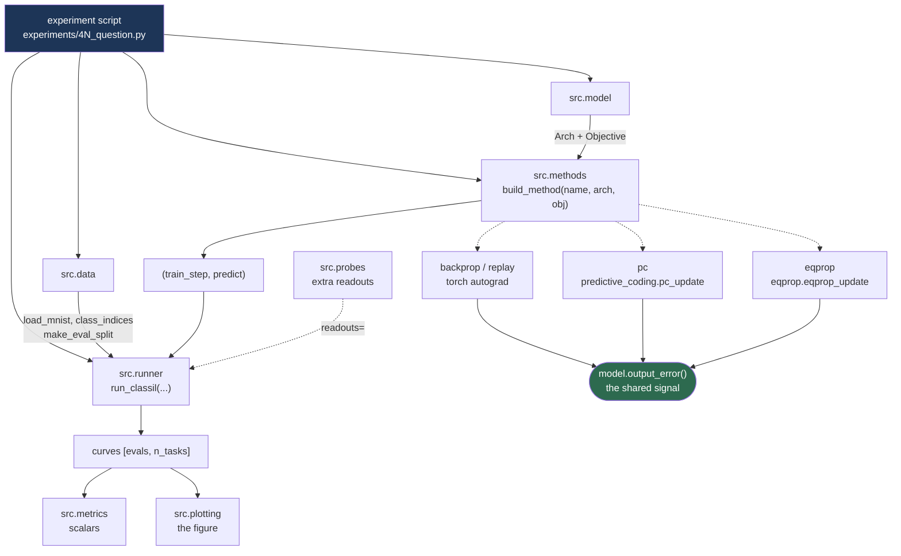

# `src/` — what each piece does and how it fits together

Written for someone running experiments, not maintaining a library. Every line number here was
read from the source on 2026-08-10.

---

## The one idea

Four learning rules have to be compared. If they differ in *anything* except the rule — a
different nonlinearity, a softmax on one and not the others, a different target coding — then a
difference in forgetting is not evidence about the rule. So the code is arranged around one
choke point:

```python
output_error(out, target, obj, active) -> e = -dL/dout
```

**All four rules consume the same `e`.** Backprop pushes it through autograd; predictive coding
uses it as the top-layer error that drives relaxation; equilibrium propagation uses it as the
nudge. Everything upstream of that call (`Arch`, `Objective`) is shared, and everything
downstream is the rule under test. That is the whole design.

---

## How a run flows



Read it as three stages. **Configure** (`data`, `model`) → **build** (`methods`) → **run and
measure** (`runner`, `metrics`, `plotting`). `probes` is optional and plugs into the run as extra
readouts.

---

## The two objects you configure

Both are frozen dataclasses in [model.py](../src/model.py). Change an experiment by changing
these, not by editing the rules.

### `Arch` — what the network *is* ([model.py:35](../src/model.py#L35))

| Field | Meaning |
|---|---|
| `in_dim`, `out_dim` | 196 in; 10 out for Class-IL, 5 for Domain-IL |
| `hidden` | `int` → one hidden layer. `(32, 32)` → two. This is the only thing you change for depth. |
| `act` | **hidden** nonlinearity: `tanh`, `sigmoid`, `relu`, `identity`, … |
| `bias` | biases on/off |
| `init`, `init_gain` | `scaled_normal` / `kaiming_uniform` / `xavier_normal` |

`arch.widths` gives the full layer sizes; `arch.n_hidden` counts hidden layers. Depth is *derived*
from `hidden`, so nothing else in the codebase has a hard-coded layer count.

### `Objective` — what the loss *says* ([model.py:66](../src/model.py#L66))

| Field | Meaning |
|---|---|
| `loss` | `mse` \| `ce` \| `hinge` |
| `target` | `onehot` → 1 / 0 · `pm1` → +1 / −1 |
| `mask` | `True` → absent classes get **zero** error, so they receive no gradient at all |
| `reduction` | `mean` over the batch, or `sum` (Song & Bogacz use `sum` — this is why their learning rates are ~500× smaller, not a different regime) |

---

## Output mechanics — the three independent axes

This is the part that is easy to conflate, so here it is against the actual lines.

**The output layer is always linear.** `forward()` applies `arch.f` on the way *out* of each
hidden layer, and returns the last layer's affine sum `z` **unactivated**
([model.py:195-199](../src/model.py#L195-L199)). So `act="tanh"` describes the hidden units and
says nothing about the output. "tanh hidden, linear output, squared error" is one configuration,
not a contradiction.

The three axes, and where each lives:

| Axis | Controlled by | Effect |
|---|---|---|
| **1. Hidden nonlinearity** | `Arch.act` | `tanh`, `sigmoid`, `relu`, … Applies to hidden layers only. |
| **2. Output stage** | `Objective.loss` | `mse`/`hinge` → raw linear readout, no squashing. `ce` → a softmax, applied **inside `output_error`** ([model.py:244](../src/model.py#L244)), not in `forward`. |
| **3. Target coding** | `Objective.target` | `onehot` → fill 0, set 1. `pm1` → fill −1, set +1 ([model.py:222](../src/model.py#L222)). |

And what `output_error` actually computes ([model.py:237](../src/model.py#L237)):

```python
mse    e = target - out                                   # plain residual
ce     e = target - softmax(out)                          # softmax lives HERE
hinge  e = target where (margin - target*out) > 0 else 0  # only violated margins push
if obj.mask: e = e * active_vec                           # absent classes -> exactly 0
```

Two consequences worth holding onto:

- `predict()` argmaxes the **raw** outputs even under `ce`. That is correct — softmax is
  monotone, so it cannot change an argmax. The softmax exists to shape the *gradient*, nothing
  else.
- Under `mse` the "output stage" is genuinely just the affine sum. There is no squashing
  anywhere near the output, under any rule.

### The presets — and what happens if you pass nothing

```python
UNIFIED_ARCH = Arch(act="tanh", bias=True, init="scaled_normal")   # the protocol
UNIFIED_OBJ  = Objective(loss="mse", target="onehot", mask=False)
```

**The default is the protocol.** Omit `arch=`/`obj=` and every rule gets these. Passing them
explicitly is still preferred in new work, because it puts the specification in the script where
a reader will look for it — but forgetting can no longer silently change what a rule is.

`LEGACY_SPEC` ([model.py:98](../src/model.py#L98)) holds each rule's *pre-unification*
specification — backprop with ReLU + cross-entropy, PC with tanh + squared error, EqProp with a
±1 hinge. Under those, each rule has a different nonlinearity **and** a different loss, so any
difference between rules confounds the rule with its output structure. It is reachable only by
asking for it by name:

```python
make_backprop(..., **legacy("backprop"))     # as experiments 01-15 ran
```

Experiments 01–15 now do exactly that, so they keep their original meaning. **Do not use
`legacy()` in new work.**

---

## Module reference

### [data.py](../src/data.py) — datasets and eval sets
`load_mnist(size=14)` → (train, test), scaled [0,1]. `class_indices(ds)` → `{class: indices}`,
which every other function takes. `make_eval_split(test, ...)` → **two disjoint** held-out sets:
stop on one, report on the other, so early stopping cannot bias the published number.
`label_remapper(task)` builds the Domain-IL class→unit lookup — and deliberately does **not**
sort, because sorting pairs rank-matched classes and that quietly suppresses the interference
the experiment measures ([data.py:64-72](../src/data.py#L64-L72)).

### [model.py](../src/model.py) — specification and forward pass
`Arch`, `Objective`, `Params`, `init_params`, `forward`, `output_error`. `Params` holds `.Ws` /
`.bs` lists and exposes `.W1`, `.b2`, … as **read-only** 1-indexed aliases; in-place updates must
go through `.Ws[i]`. `forward` returns `(hs, out)` where `hs` is the list of **pre-activation**
hidden states — `arch.f(hs[l])` is what layer `l` transmits.

### [methods.py](../src/methods.py) — the four rules
`build_method(name, arch=, obj=, hidden=, out_dim=, seed=, handle=, **overrides)` →
`(train_step, predict)` for `backprop` · `replay` · `pc` · `eqprop` · `eqprop_gated`.
`train_step(x, y, active=None)` performs one update; `predict(x, raw=False)` returns class
indices, or pre-argmax outputs with `raw=True`.

Pass a dict as `handle=` and it is filled with `params`, `features`, `arch`, `obj`, `diag` and
`freeze` — that is how an experiment reaches inside a run without the rules knowing about it.

**Replay** keeps a **per-label reservoir**: `per_class` slots per output label, each holding a
uniform sample of every example of that label seen so far. It stores from the stream and never
touches the dataset, so `train_data`/`class_idx` are accepted and ignored. This is what makes it
correct under Domain-IL, where classes 5–9 arrive as units 0–4 and any "keep the first
`per_class`" rule would fill up on task 1 and never store task 2 at all. Buffer contents are
exposed as `handle["diag"]["buffer_x"]` / `["buffer_labels"]`.

### [predictive_coding.py](../src/predictive_coding.py) and [eqprop.py](../src/eqprop.py) — the two energy-based rules
Called only from `methods.py`. Both relaxation loops were traced line by line and are correct at
arbitrary depth. Leave them alone unless an experiment cannot be expressed without a change.

### [runner.py](../src/runner.py) — the training loops
- `run_joint` — everything at once. Ceilings and learning-rate calibration.
- `run_classil` — **the main loop.** Tasks in sequence, per-task accuracy logged throughout.
- `run_alternating` — Song & Bogacz's alternating schedule. Not on the current path.

`run_classil` returns `dict(steps, curves, switches, reached)`. `curves[readout]` is
`[evals, n_tasks]`. `reached` records whether each task actually met its accuracy criterion, so a
rule that never got there is visible rather than silently falling back to the step budget.

### [probes.py](../src/probes.py) — asking what is left in the hidden layer
Pass these as `readouts={"ncm": ...}` and one run yields several readouts at once. The decisive
diagnostic:

| argmax | NCM | Reading |
|---|---|---|
| low | **high** | hidden code survived — the damage is in the output layer (*calibration*) |
| low | low | hidden code was destroyed (*representation drift*) |

`live_ncm_fn` rebuilds prototypes at current weights (is the class information still decodable?);
`frozen_ncm_fn` uses prototypes snapshotted at the task switch (has the code *moved*?). They
answer different questions — see [probes.py:96-101](../src/probes.py#L96-L101).

### [metrics.py](../src/metrics.py) — curves → numbers
Pure numpy, no torch, no plotting. `crossover`, `value_when` (task-1 accuracy at the moment task
2 reaches a standard), `first_cross`, `half_life`, `area_retained`, `bootstrap_ci`,
`align_runs`/`pad_stack` for runs of unequal length under early stopping.

### [plotting.py](../src/plotting.py) — figures
`plot_learning_curves`, `plot_trajectory`, `plot_heatmap`. All take
`{method: array[runs, evals, n_tasks]}` and are NaN-safe.

---

## A complete experiment, top to bottom

```python
from src.data import load_mnist, class_indices, make_eval_split
from src.model import UNIFIED_ARCH, UNIFIED_OBJ, replace
from src.methods import build_method
from src.runner import run_classil

train, test = load_mnist(size=14)
cidx  = class_indices(train)
tasks = [[0, 1, 2, 3, 4], [5, 6, 7, 8, 9]]

arch = replace(UNIFIED_ARCH, in_dim=196, hidden=H, out_dim=10)   # 5 for Domain-IL
stop_eval, report_eval = make_eval_split(test, per_class=100)

for seed in range(n_seeds):
    handle = {}
    train_step, predict = build_method(
        "pc", arch=arch, obj=UNIFIED_OBJ, seed=seed, handle=handle, lr=lr)

    out = run_classil(train_step, predict, tasks, train, cidx,
                      report_eval=report_eval, stop_eval=stop_eval,
                      stop_threshold=0.9, max_iters_per_task=2000)
    # out["curves"]["argmax"] -> [evals, 2]
```

For **Domain-IL** change two things and nothing else:

```python
arch      = replace(UNIFIED_ARCH, in_dim=196, hidden=H, out_dim=5)
label_map = {c: i % 5 for i, c in enumerate(tasks[0] + tasks[1])}
run_classil(..., label_map=label_map)
```

---

## Freezing

`handle["freeze"]` is a mutable set. Add a name mid-run and that parameter stops learning:

```python
handle["freeze"].add("W1")     # W1 held; b1 and W2 keep learning
```

Names are exact and 1-indexed — `W1`, `b1`, `W2`, `b2`, … **Freezing `W1` does not freeze `b1`.**
To hold a whole layer still, name both. All four rules follow this convention, which is what
makes a freezing experiment a comparison rather than a confound. Unknown names are ignored, so a
set written for a 2-layer net is harmless on a deeper one.

---

## Known gaps

| | |
|---|---|
| **No protocol object** | The protocol lives in prose in `presentation_plan.md`, not in code. Every script currently restates split, thresholds, seeds and eval sets by hand. This is the main piece of new code still to write. |
| **No metrics grid** | `metrics.py` has most of the pieces, but target alignment and the [R31] inefficiency ratio are not implemented anywhere. |
| **`BOGACZ_ARCH` is stale** | Encodes `(32,32)`/`out_dim=10`; experiment 34 later read the paper as 784-32-32-32-5. The reproduction is archived, but the constant is wrong and sits in a shared module. |
| **Experiment 15 is dead** | Calls `run_classil` positionally against the old signature and unpacks three values from what is now a dict. Left in `experiments/` because its question is live in the plan. |
| **`run_alternating` points at nothing** | Its docstring cites `experiments/nature_forgetting/*.yaml`, which does not exist. The runner belongs to the archived reproduction. |
| **`pc_settle` backtracking assumes MSE** | [predictive_coding.py:74](../src/predictive_coding.py#L74) treats `output_error` as a residual, true only under `mse`. Backtracking defaults off, so this is latent. |
| **`loss_value` ignores `reduction`** | Always averages, while `batch_scale` honours `sum`. Reported loss disagrees with the applied gradient under `sum`. Reporting only. |
